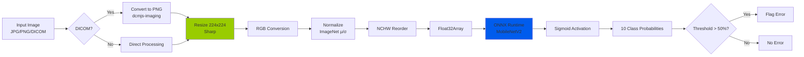
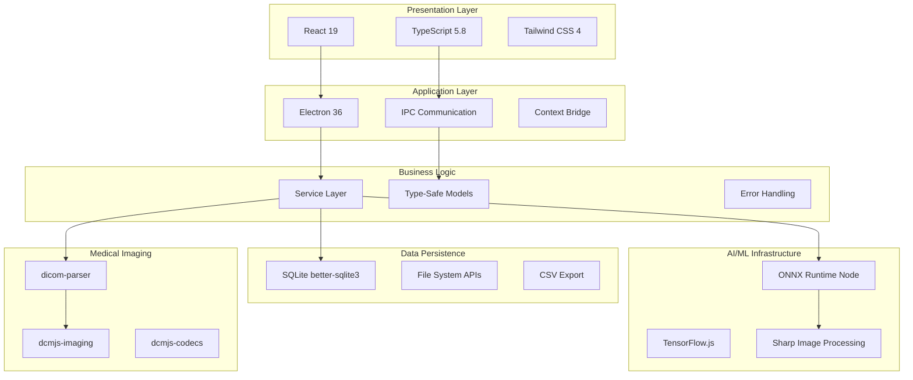

# PosiCheck

<div align="center">


**AI-Powered Positioning Error Detection for Dental Panoramic Radiographs**

[](https://www.electronjs.org/)
[](https://reactjs.org/)
[](https://www.typescriptlang.org/)
[](https://onnxruntime.ai/)
[](https://opensource.org/licenses/MIT)

*A production-ready desktop application combining medical imaging, machine learning, and modern web technologies*

[Features](#-features) • [Architecture](#-architecture) • [Quick Start](#-quick-start) • [Tech Stack](#-tech-stack) • [Screenshots](#-screenshots)

</div>

---

## 📋 Overview

**PosiCheck** is a cross-platform desktop application that leverages deep learning to automatically detect patient positioning errors in dental panoramic radiographs. Built with Electron and React, it combines the power of ONNX Runtime for ML inference with comprehensive DICOM support, helping dental professionals improve image quality and diagnostic accuracy.

### What Makes This Project Stand Out

🎯 **Production-Ready Architecture** - Clean separation of concerns with Electron main/renderer processes  
🧠 **AI/ML Integration** - ONNX Runtime with MobileNetV2 for efficient CPU inference  
🏥 **Medical Imaging Support** - Full DICOM parsing with compressed transfer syntax handling  
💾 **Robust Data Management** - SQLite database with proper schema design and migrations  
🔒 **Type-Safe IPC** - TypeScript-powered inter-process communication  
🧪 **Tested Codebase** - Jest + React Testing Library with coverage reporting  
📦 **Multi-Platform** - Windows, macOS, and Linux distribution builds  

---

## ✨ Features

### Core Functionality

- **🔍 AI-Powered Detection**: Identifies 10 types of positioning errors with confidence scores
  - Chin position (high/low)
  - Patient position (forward/backward)
  - Head tilt and rotation
  - Tongue position
  - Slumped posture
  - Patient movement
  - Missing bite block

- **🏥 Medical Imaging**: Comprehensive DICOM support
  - Automatic format detection
  - Compressed transfer syntax decoding
  - Real-time conversion to displayable formats
  - Fallback rendering for edge cases

- **📊 History Management**: SQLite-backed detection history
  - Persistent storage of all analyses
  - Searchable and filterable records
  - Image thumbnails and full-size previews
  - Optional notes and annotations

- **💬 Feedback System**: Continuous improvement pipeline
  - Accuracy rating mechanism
  - Error reporting (false positives/negatives)
  - Bulk feedback export (ZIP with CSV + images)
  - Data collection for model retraining

- **👤 User Profiles**: Multi-user support
  - Practitioner information storage
  - Organization/clinic tracking
  - Usage statistics

---

## 🏗️ Architecture

### System Overview

```mermaid
graph TB
    subgraph "Renderer Process (React/TypeScript)"
        A[User Interface]
        B[React Components]
        C[State Management]
        D[Tailwind CSS]
    end
    
    subgraph "Preload Bridge"
        E[Context Bridge]
        F[Type-Safe IPC API]
    end
    
    subgraph "Main Process (Node.js)"
        G[Electron Main]
        H[IPC Handlers]
        I[Service Layer]
    end
    
    subgraph "Core Services"
        J[ONNX Inference]
        K[DICOM Processing]
        L[History Management]
        M[Feedback Collection]
        N[Profile Service]
    end
    
    subgraph "Data Layer"
        O[(SQLite Database)]
        P[File System]
        Q[ONNX Model]
    end
    
    A --> B
    B --> C
    C --> F
    F --> E
    E --> H
    H --> I
    I --> J
    I --> K
    I --> L
    I --> M
    I --> N
    J --> Q
    K --> P
    L --> O
    M --> O
    N --> O
    
    style A fill:#61dafb
    style G fill:#47848f
    style Q fill:#005ced
    style O fill:#003b57
```



### ML Inference Pipeline



### Technology Stack Layers



---

## 🚀 Quick Start

### Prerequisites

- **Node.js** 18+ (LTS recommended)
- **npm** 9+
- **Python** 3.9+ (for native module builds)
- **Visual Studio Build Tools** (Windows) or **Xcode CLI Tools** (macOS)

### Installation

```bash
# Clone the repository
git clone https://github.com/yourname/posicheck.git
cd posicheck

# Install dependencies
npm install

# Rebuild native modules for Electron
npm run rebuild
```

### Development Mode

```bash
# Start the development environment (React + Electron)
npm run dev

# Or run separately:
npm run dev:react      # React dev server only (port 5123)
npm run dev:electron   # Electron main process only
```

The application will launch automatically with:
- Hot Module Replacement (HMR) for React components
- DevTools opened by default
- Live reloading on code changes

### Production Build

```bash
# Build for your platform
npm run dist:win       # Windows (portable + MSI)
npm run dist:mac       # macOS (DMG, ARM64)
npm run dist:linux     # Linux (AppImage, ARM64)

# Output directory: dist/
```

### Testing

```bash
# Run all tests
npm test

# Generate coverage report
npm run test:coverage

# Watch mode for development
npm run test:watch

# Verbose output for debugging
npm run test:verbose
```

Coverage reports are generated in the `coverage/` directory.

---

## 🛠️ Tech Stack

<div align="center">

| Category | Technologies |
|----------|-------------|
| **Frontend** | React 19 • TypeScript 5.8 • Tailwind CSS 4 • Vite 6 |
| **Desktop Framework** | Electron 36 • electron-builder |
| **AI/ML** | ONNX Runtime 1.20 • TensorFlow.js 4.22 • Sharp 0.34 |
| **Medical Imaging** | dicom-parser • dcmjs-imaging • dcmjs-codecs |
| **Database** | better-sqlite3 11.10 • SQLite 3 |
| **Testing** | Jest 30 • React Testing Library 16 • ts-jest |
| **Build Tools** | Vite • TypeScript compiler • Autoprefixer |
| **Code Quality** | ESLint 9 • TypeScript ESLint • React Hooks linting |

</div>

### Why These Technologies?

**Electron**: Cross-platform desktop app with native capabilities and full Node.js access  
**React + TypeScript**: Type-safe UI development with component reusability  
**ONNX Runtime**: Hardware-agnostic ML inference with excellent performance  
**SQLite**: Embedded database requiring no server setup, perfect for desktop apps  
**Vite**: Lightning-fast builds with native ES modules support  
**Sharp**: High-performance image processing library built on libvips  

---

## 📁 Project Structure

```
posicheck/
├── src/
│   ├── electron/              # Main process (Backend)
│   │   ├── db/                # Database layer
│   │   │   └── database.ts    # SQLite setup & schema
│   │   ├── ipc/               # IPC request handlers
│   │   │   ├── inference.ipc.ts
│   │   │   ├── history.ipc.ts
│   │   │   ├── feedback.ipc.ts
│   │   │   ├── profile.ipc.ts
│   │   │   ├── model.ipc.ts
│   │   │   └── app.ipc.ts
│   │   ├── services/          # Business logic
│   │   │   ├── onnx-inference.service.ts
│   │   │   ├── dicom.service.ts
│   │   │   ├── history.service.ts
│   │   │   ├── feedback.service.ts
│   │   │   ├── profile.service.ts
│   │   │   └── model.service.ts
│   │   ├── model/             # ML models
│   │   │   ├── model.onnx     # ONNX model (138 KB)
│   │   │   └── model.onnx.data # Weights (8.5 MB)
│   │   ├── main.ts            # Electron entry point
│   │   ├── preload.cts        # Context bridge
│   │   └── util.ts            # Helpers
│   ├── ui/                    # Renderer process (Frontend)
│   │   ├── components/        # Reusable UI components
│   │   │   ├── Sidebar.tsx
│   │   │   ├── UploadBox.tsx
│   │   │   ├── ErrorCard.tsx
│   │   │   ├── Modal.tsx
│   │   │   ├── Button.tsx
│   │   │   ├── InputField.tsx
│   │   │   └── __tests__/     # Component tests
│   │   ├── pages/             # Application pages
│   │   │   ├── HomePage.tsx
│   │   │   ├── DetectionPage.tsx
│   │   │   ├── HistoryPage.tsx
│   │   │   ├── FeedbackPage.tsx
│   │   │   └── ProfilePage.tsx
│   │   ├── App.tsx            # Main app component
│   │   ├── main.tsx           # React entry point
│   │   └── index.css          # Global styles
│   └── types/                 # TypeScript definitions
│       └── electron.d.ts      # IPC type definitions
├── coverage/                  # Test coverage reports
├── dist/                      # Production builds
├── dist-electron/             # Compiled Electron code
├── dist-react/                # Built React app
├── package.json               # Dependencies & scripts
├── tsconfig.json              # TypeScript config
├── jest.config.js             # Jest configuration
├── vite.config.ts             # Vite configuration
└── electron-builder.json      # Distribution config
```

---

## 🖼️ Screenshots

<div align="center">

### Detection Page
*Upload an image and get instant AI-powered positioning error analysis*

### History Management
*Browse, search, and review past detections with detailed insights*

### Feedback System
*Rate accuracy and contribute to continuous model improvement*

### Profile Management
*Manage practitioner information and organization details*

</div>

> **Note**: Add actual screenshots to showcase the UI in action

---

## 🔧 Key Implementation Details

### ONNX Inference Pipeline

The application implements a production-grade ML inference pipeline:

1. **Image Preprocessing** (Sharp)
   - Resize to 224×224 with bilinear interpolation
   - Convert to RGB (remove alpha channel)
   - Normalize with ImageNet statistics (μ=[0.485, 0.456, 0.406], σ=[0.229, 0.224, 0.225])

2. **Tensor Preparation**
   - Reorder from HWC to NCHW (channels-first)
   - Convert to Float32Array
   - Create ONNX tensor with shape [1, 3, 224, 224]

3. **Model Inference**
   - MobileNetV2 architecture (PyTorch → ONNX)
   - Single-pass inference on CPU
   - Outputs 10 class logits

4. **Post-processing**
   - Apply sigmoid activation
   - Generate probability distribution
   - Threshold at 50% for error detection

### DICOM Processing

Comprehensive medical imaging support:

- Automatic DICOM detection (magic bytes `DICM`)
- Support for compressed transfer syntaxes via `dcmjs-imaging`
- Native pixel decoder integration
- Fallback to `dicom-parser` for uncompressed files
- Conversion to PNG for display and inference compatibility

### Database Schema

Efficient SQLite schema with proper relationships:

```sql
-- Detection history with JSON predictions
history (id, image_path, timestamp, prediction_data, notes)

-- Individual errors for query flexibility
detection_errors (id, history_id, error_type, confidence)

-- User profiles
profile (id, name, email, phone, country, organization, created_at, updated_at)

-- Feedback collection
feedback (id, image_path, timestamp, accuracy_rating, error_types, extra_feedback)
```

### Type-Safe IPC

All IPC communication is type-safe through TypeScript:

```typescript
// Preload script exposes typed methods
window.electron.sendFileForInference(file)
  → Promise<{success, predictions, imagePath, imageBase64?, error?}>

// Main process handlers are strongly typed
ipcMain.handle('sendFileForInference', async (_, file: FileInput) => {
  // Type-checked implementation
})
```

---

## 🧪 Testing Strategy

- **Unit Tests**: Component logic and utility functions
- **Integration Tests**: IPC communication and service layer
- **Coverage Target**: Core components (Sidebar, Button, InputField, Modal, ErrorCard)
- **Testing Tools**: Jest + React Testing Library + ts-jest
- **Current Coverage**: Available in `coverage/lcov-report/index.html`

---

## 📦 Building for Production

### Build Process

1. **TypeScript Compilation**
   ```bash
   tsc --project src/electron/tsconfig.json  # Electron code
   tsc -b && vite build                      # React app
   ```

2. **Electron Builder**
   ```bash
   electron-builder --win --x64  # Creates installer & portable
   ```

3. **Output**
   - Windows: `.msi` installer + portable `.exe`
   - macOS: `.dmg` disk image (ARM64)
   - Linux: `.AppImage` (ARM64)

### Distribution Configuration

See `electron-builder.json` for platform-specific settings:
- App ID: `com.neo.posicheck`
- Icon: `icon_posicheck.png` (auto-converted to platform formats)
- Extra resources: Models, assets, preload script
- Code signing: Ready for certificate integration

---

## 🚧 Development Roadmap

### Completed ✅
- [x] AI-powered error detection with 10 error types
- [x] Full DICOM support with compression handling
- [x] SQLite database with migrations
- [x] History and feedback systems
- [x] Cross-platform builds
- [x] Component testing setup
- [x] Type-safe IPC architecture

### Planned 🔮
- [ ] E2E testing with Playwright
- [ ] CI/CD pipeline (GitHub Actions)
- [ ] Model versioning and auto-updates
- [ ] Cloud backup/sync (optional)
- [ ] Multi-user authentication
- [ ] Advanced reporting and analytics
- [ ] Integration with PACS systems

---

## 🤝 Contributing

Contributions are welcome! Please follow these guidelines:

1. Fork the repository
2. Create a feature branch (`git checkout -b feature/amazing-feature`)
3. Commit your changes (`git commit -m 'Add amazing feature'`)
4. Push to the branch (`git push origin feature/amazing-feature`)
5. Open a Pull Request

### Development Guidelines

- Follow TypeScript strict mode
- Write tests for new features
- Update documentation as needed
- Follow the existing code style (ESLint)
- Ensure all tests pass before submitting

---

## 📄 License

This project is licensed under the MIT License - see the [LICENSE](LICENSE) file for details.

---

## 👨‍💻 Author

**Neo**

---

## 🙏 Acknowledgments

- **ONNX Runtime Team** - For the excellent ML inference library
- **Electron Community** - For the robust desktop framework
- **React Team** - For the amazing UI library
- **DICOM Community** - For medical imaging standards and tools

---

<div align="center">

**Built with ❤️ using Electron, React, and ONNX Runtime**

*PosiCheck - Improving dental imaging quality through AI*

</div>