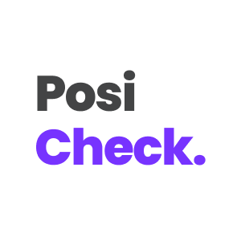
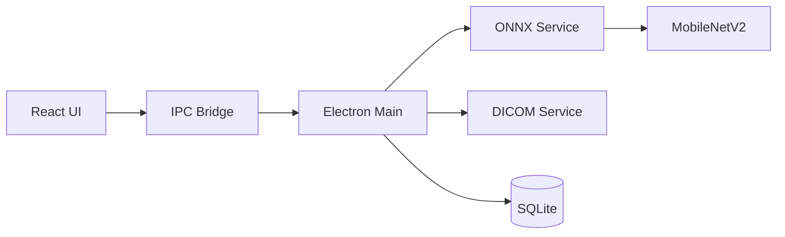

# PosiCheck

<div align="center">



**AI-Powered Positioning Error Detection for Dental Panoramic Radiographs**

[](https://www.electronjs.org/)
[](https://reactjs.org/)
[](https://www.typescriptlang.org/)
[](https://onnxruntime.ai/)
[](https://opensource.org/licenses/MIT)

*Production-ready desktop app combining medical imaging, ML inference, and modern web tech*

</div>

---

## 📋 Overview

**PosiCheck** is a cross-platform Electron application that uses deep learning to automatically detect patient positioning errors in dental panoramic radiographs. It helps dental professionals identify common mistakes that compromise image quality.

### Key Highlights

🎯 **Production-Ready** - Clean Electron/React architecture with type-safe IPC  
🧠 **AI-Powered** - ONNX Runtime + MobileNetV2 for CPU inference  
🏥 **Medical Imaging** - Full DICOM support with compressed transfer syntaxes  
💾 **Data Management** - SQLite database with proper schema design  
🧪 **Tested** - Jest + React Testing Library with coverage  
📦 **Cross-Platform** - Windows, macOS, Linux builds  

---

## ✨ Features

**🔍 AI Detection** - Identifies 10 positioning error types with confidence scores:
- Chin position (high/low), patient position (forward/backward)
- Head tilt/rotation, tongue position, slumped posture
- Patient movement, missing bite block

**🏥 DICOM Support** - Parse and display medical imaging formats  
**📊 History** - SQLite-backed detection records with notes  
**💬 Feedback** - Rate accuracy, export data for model improvement  
**👤 Profiles** - Multi-user practitioner information  

---

## 🏗️ Architecture



**Tech Stack**: Electron 36 • React 19 • TypeScript 5.8 • ONNX Runtime • Sharp • better-sqlite3

---

## 🚀 Quick Start

### Prerequisites
- Node.js 18+, npm 9+
- Python 3.9+ (for native builds)
- Platform build tools (VS Build Tools / Xcode CLI)

### Installation
```bash
git clone https://github.com/yourname/posicheck.git
cd posicheck
npm install
npm run rebuild  # Rebuild native modules
```

### Development
```bash
npm run dev      # Start React + Electron with HMR
```

### Production Build
```bash
npm run dist:win    # Windows (portable + MSI)
npm run dist:mac    # macOS (DMG, ARM64)
npm run dist:linux  # Linux (AppImage, ARM64)
```

### Testing
```bash
npm test                # Run tests
npm run test:coverage   # Generate coverage
```

---

## 📁 Project Structure

```
posicheck/
├── src/
│   ├── electron/           # Main process
│   │   ├── db/             # SQLite database
│   │   ├── ipc/            # IPC handlers
│   │   ├── services/       # Business logic
│   │   │   ├── onnx-inference.service.ts
│   │   │   ├── dicom.service.ts
│   │   │   └── ...
│   │   ├── model/          # ONNX model files
│   │   └── main.ts         # Entry point
│   └── ui/                 # Renderer process
│       ├── components/     # React components
│       ├── pages/          # App pages
│       └── App.tsx
├── docs/examples/          # Code examples
├── coverage/               # Test coverage
└── dist/                   # Production builds
```

---

## � ML Pipeline

The ONNX inference pipeline:

1. **Preprocess** - Resize to 224×224, normalize with ImageNet stats
2. **Inference** - MobileNetV2 model outputs 10 class logits  
3. **Post-process** - Apply sigmoid, threshold at 50% confidence

**Model**: PyTorch MobileNetV2 → ONNX (138KB + 8.5MB weights)

---

## 💾 Database Schema

```sql
-- Detection history
history (id, image_path, timestamp, prediction_data, notes)

-- Individual errors (for queries)
detection_errors (id, history_id, error_type, confidence)

-- User profiles
profile (id, name, email, organization, ...)

-- Feedback collection
feedback (id, image_path, accuracy_rating, error_types, ...)
```

---

## 🧪 Testing

- **Unit Tests**: Component logic with Jest
- **Coverage**: Core components (Sidebar, Button, Modal, etc.)
- **Reports**: Available in `coverage/lcov-report/index.html`

Run `npm run test:coverage` to generate reports.

---

## 📦 Distribution

Builds use `electron-builder` with platform-specific configurations:
- **Windows**: MSI installer + portable EXE
- **macOS**: DMG disk image (ARM64)
- **Linux**: AppImage (ARM64)

Output in `dist/` directory. See `electron-builder.json` for config.

---

## 🚧 Roadmap

**Current** ✅
- AI detection for 10 error types
- Full DICOM support
- SQLite persistence
- Cross-platform builds
- Component testing

**Planned** 🔮
- E2E testing (Playwright)
- CI/CD pipeline
- Model auto-updates
- Cloud sync (optional)
- PACS integration

---

## 🤝 Contributing

1. Fork the repo
2. Create feature branch (`git checkout -b feature/name`)
3. Commit changes (`git commit -m 'Add feature'`)
4. Push to branch (`git push origin feature/name`)
5. Open Pull Request

**Guidelines**: Follow TypeScript strict mode, write tests, update docs.

---

## 📄 License

MIT License - see [LICENSE](LICENSE) file for details.

---

## 👨‍💻 Author

**Neo Sock Cheng**

---

## 🙏 Acknowledgments

- ONNX Runtime team - Excellent ML inference library
- Electron community - Desktop framework
- React team - UI library
- DICOM community - Medical imaging standards

---

<div align="center">

**Built with ❤️ using Electron, React, and ONNX Runtime**

*PosiCheck - Improving dental imaging quality through AI*

</div>